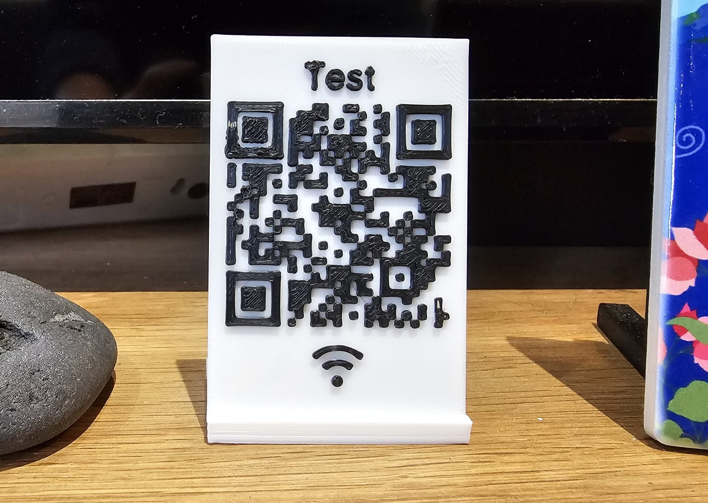
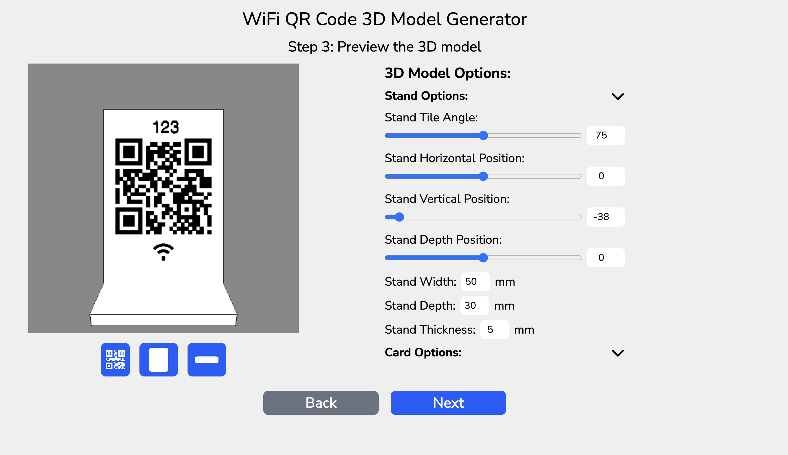
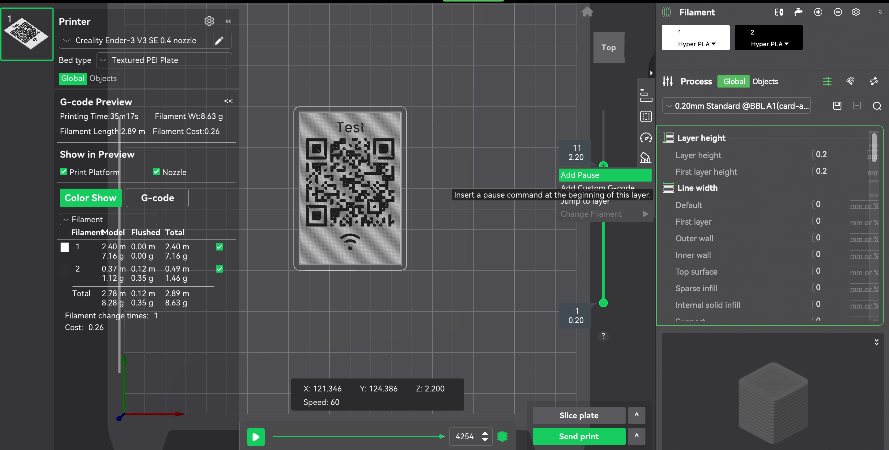

# WiFi QR Code 3D Model Generator

<b>Create your own 3D WiFI QR Code at home</b>

## Live Demo

### https://shr00m335.github.io/wifi-3d-qr-code-model-generator

## Description

This project aims to provide an easy and accessible way for any maker to generate a WiFi QR Code as a 3D model for display. It can be deployed locally and does not require any internet access.

## Features

1. Easy to use interface
   - Follow the steps on the screen and enter the required information
2. Customizable 3D Model
   - Adjust the size and position of the components
   - Choose what component to include or exclude
   - Choose the error correction level of the QR Code
3. Design for 3D printing
   - Export 3D model as .stl or .3mf
   - Put in the slicer and ready to print

## 3D printing tips

The model should be able to print on any 3D printer, including those without color-changing feature.

### Model Export

It is recommended to export the model as **two separate file** (which is the default export option)

1. QR Code and Base (together)
2. Stand (separate)

Export the file as .3mf to retain the color information

### Printing Seqeunce

1. Print the **stand** first with any color filament
2. Print the **Base and QR Code** second
3. Put the base into the slot on the stand. It should fit tightly without any glue

It should only requires changing the filament once

### Size of Model

It is recommended to maintain a minimum size of 50mm x 70mm, which is the default model size, to ensure clarity on the QR Code.

### Print Settings

The default settings of any printer with a 0.4mm nozzle should be fine.

### Manual Color Change

If your printer does not support auto filament changing, you can manually swap it in the process.

1. In the slicer, add a pause color before the QR Code starting to print
2. When the printer pauses, **change the filament** (e.g. from white to black)
3. Resume once the new filament is loaded

_Note: There may be color blend on the first few layers after the swap, but this will be covered as the print continues._

The example shown above was printed on a **Creality Ender 3 V3 SE** using the manual color changing method.

## Tech Stack

1. Svelte
   - Frontend framework
2. Tailwind CSS
   - Web styling
3. Three JS
   - 3D model rendering and export

## References

- https://en.wikipedia.org/wiki/QR_code
- https://threejs.org/docs/
- https://forum.creality.com/t/multi-color-prints/4979/2
